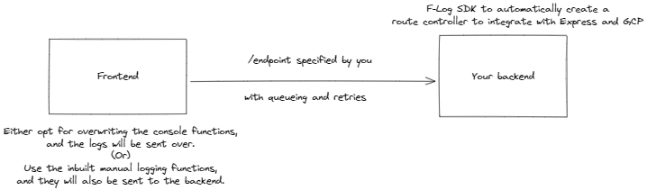

# F-Log 📒

A seamless way to integrate a logging pipeline from your frontend to your backend.
Currently supports Google Cloud Logging with Express.

<p align="center">
    </img>
</p>

## Setting it up

First install the library to both your backend and frontend repositories.

```bash
npm i f-log
```

### On the frontend

```javascript
import FLog from "f-log/client";

FLog.init({ endpoint: "", interceptNativeConsoleLogs: true });
```

Here:

- `endpoint` is the URL you want to send your logs to, it could be an endpoint to a log ingestion pipeline or an endpoint on your backend server that is created using the backend SDK of F-Log.
- `interceptNativeConsoleLogs` is a `boolean` value that will determine whether you want to intercept logs from your frontend app producted by native console functions, namely: `console.log`, `console.debug`, `console.warn` and `console.error`.

### Logging

If you've opted for intercepting native console functions, you don't have to do anything else, logs from your application will be automatically intercepted and sent to your backend server.

If you want to opt for a manual approach you can use:

```javascript
FLog.Logger.info("Info log");
FLog.Logger.log("Normal Info log with", "varying", { types }, [of], data);
FLog.Logger.error("Error log with: " + error.message);
FLog.Logger.warn("Warning");
FLog.Logger.debug("Just debugging, how y'all doing?");
```

### On the backend

#### GCP + Express

I'm assuming you have a basic understanding of what Google Cloud Logging is and what Google Cloud Service Accounts are. If not you can refer to the following:

- [Google Cloud Logging](https://cloud.google.com/logging)
- [Google Clous Service Accounts](https://cloud.google.com/iam/docs/service-account-overview)
- [Creating a Service Account](https://cloud.google.com/iam/docs/service-accounts-create)

And once you have your [Express](https://expressjs.com/) server setup, you can power it up to accept logs from your frontend with the following snippet:

```javascript
app.use(
	"/log", // Any route you want.
	loggingControllerGenerator({
		serviceAccount: JSON.parse(process.env.YOUR_GCP_LOGGING_SERVICE_ACCOUNT),
		logName:
			"a name to group your logs under (for example: frontend-logs-stream)",
		serviceName: "a name to attach with the logs (for example: frontend)",
		onError: (error) => {
			// Do something with the error
		},
	})
);
```

The [@google-cloud/logging](https://www.npmjs.com/package/@google-cloud/logging) library is used with support for automatic retries on failures and log write batching to ensure consistent delivery.

Once done, simply host your server and add its endpoint to the frontend.

## Contributions

Features, bug fixes and contributions are welcome. ☀

I have only added support for GCP logging so far but the number of services available out there are uncountable, so if you have a specific requirement, feel free to add it in.

Simply create an issue for support or fork the repo and raise a pull request for the changes you want to add to the library.
